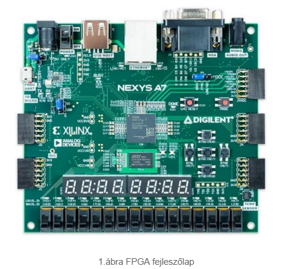
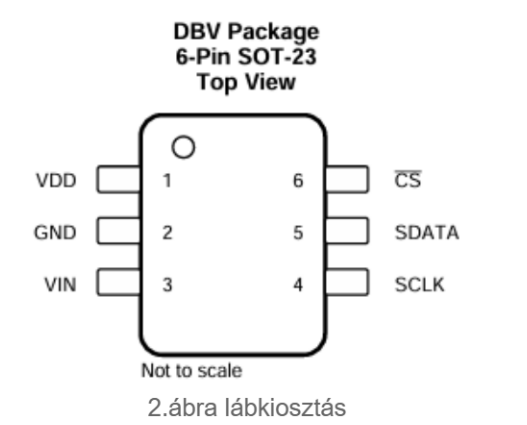
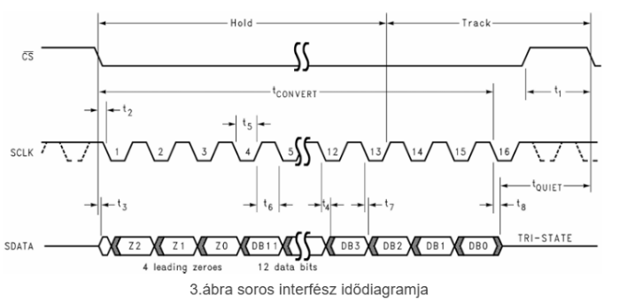
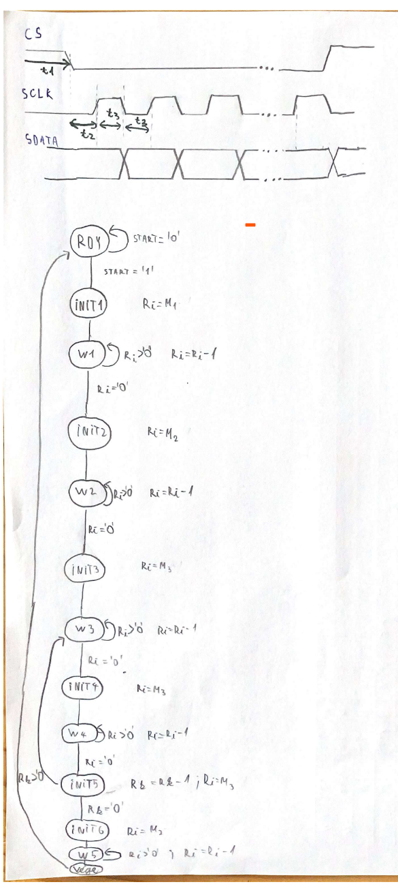
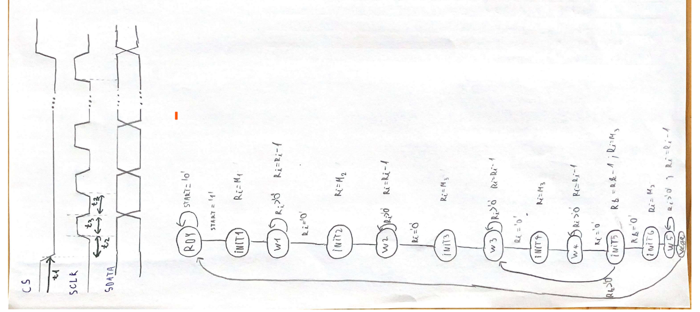
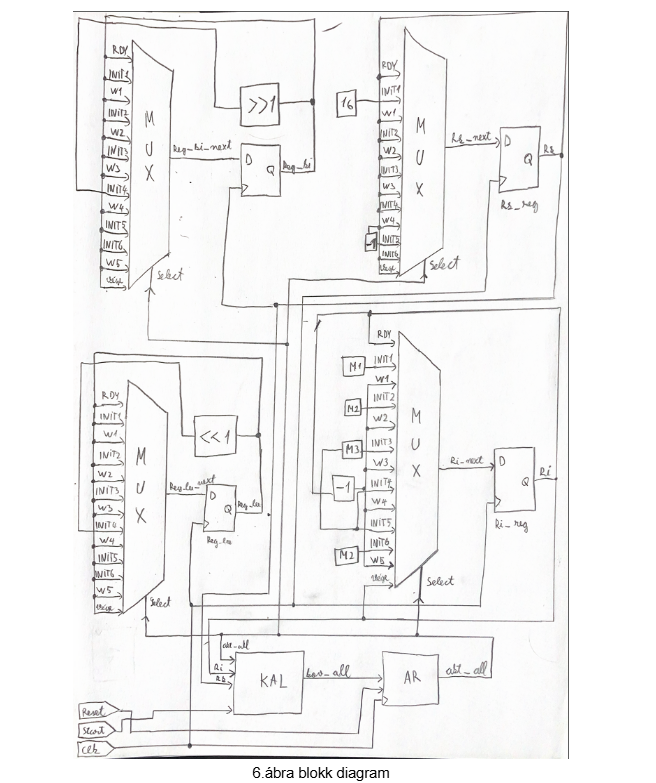
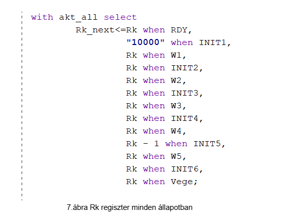
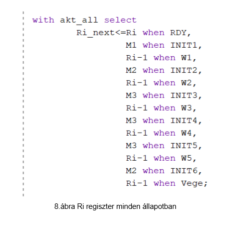

# Projekt dokumentáció
## Újrakonfigurálható digitális áramkörök
### ADCS7476 nyomásmérő szenzor 16 bites A/D konverter

A projekt során egy FPGA újrakonfigurálható digitális áramkört terveztünk. Az FPGA napjainkban egy fontos eszköz az automatizálás területén. Egy igen jó alternatívát nyújthatnak a mikrovezérlős implementációk helyett. Számos területen használják, például: mesterséges intelligencia és gépi tanulás terén, AI modellek implementálása FPGA-n, autóiparban, egézségügyben vagy űrkutatás és katonai alkalmazásokban. Nagy előnye a gyorsaság, például a mi fejlesztőlapunk képes 100MHz gyorsasággal dolgozni. Egyén előnyök még például az újra programozhatóság, nagy flexibitás vagy az olcsó kihozatali költség. 

A projekt feladatom volt egy ADCS7476 nyomásmérő szenzorral dolgozni. Az áramkör 12 biten alakítja át az analóg jelet digitális jelre. Alkalmazási területei: autóipar, ipari automatizálás, hordozható rendszerek, orvosi eszközök, műszer- és vezérlőrendszerek. Főleg olyan területekre tervezték ahol tehát olyan területre tervezték a szenzort, ahol kritikusan kevés. A hely a szenzornak és a hőmérséklet -40 és 125 C között van. Egy alacsony tápellátású analog digitál konverter, lehetőség van kikapcsolási módba állítani, amikor minimális a fogyasztása. Az analóg-digitál átalakítási sebesség függ seria clock bemenetén érkező órajeltől, az eszköz képes 20 MHz sebességre. 

A soros interfész kompatibilis az SPI kommunikációs protokollal így azt használtam a projekt során. 

A soros interfész idődiagramján látható, hogy a kommunikáció kezdetét veszi, ha a CS bemenet magas feszültségi állapotból alacsonyba lépik. Az adat 16 biten érkezik, az első 4 biten zérós értékek, majd az ezt követő 12 bit, MSB -vel kezdődően, hordozza az adatot (a levegőnyomás értékét)

A megvalósításhoz használtam FSMD komplex állapotgépet adatúttal. Az ábrán látható az állapotdiagram, 13 állapoton megy végig, a “start”’ aktiválása után lépik ki a “RDY” állapotból és végigmegy egy “INIT” “WAIT” sorozaton. Az Ri, Rk változók segítségével történik az időzítés, az SCLK meghatározása. Az Rk egy külső ciklus, azt vizsgálja, hogy végigmentünk-e a 16 biten, az Ri pedig előállítja a magas és alacsony állapotokat, késleltei az FPGA 10 ns- os jelét.

A következő kódrészlet mutatja az Ri, Rk változók meghatározását minden állapotban: 

### Források
„Brassai Tihamer_UKDA_REAL”
http://real.mtak.hu/122602/1/Brassai%20Tihamer_UKDA_REAL.pdf

https://nandland.com/lesson-1-what-is-an-fpga/

  
